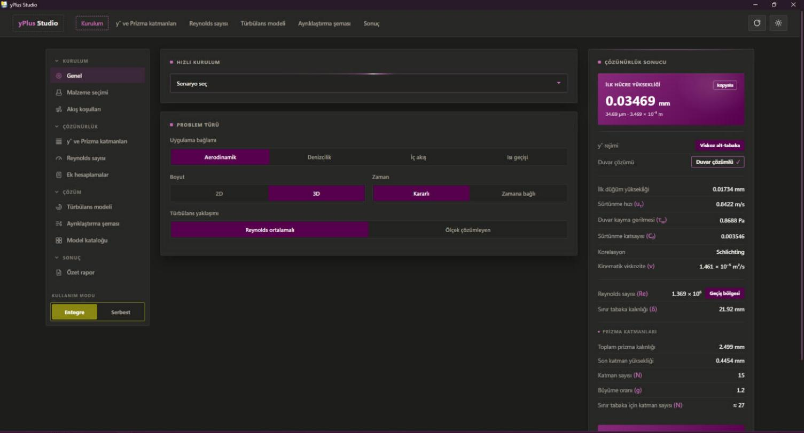
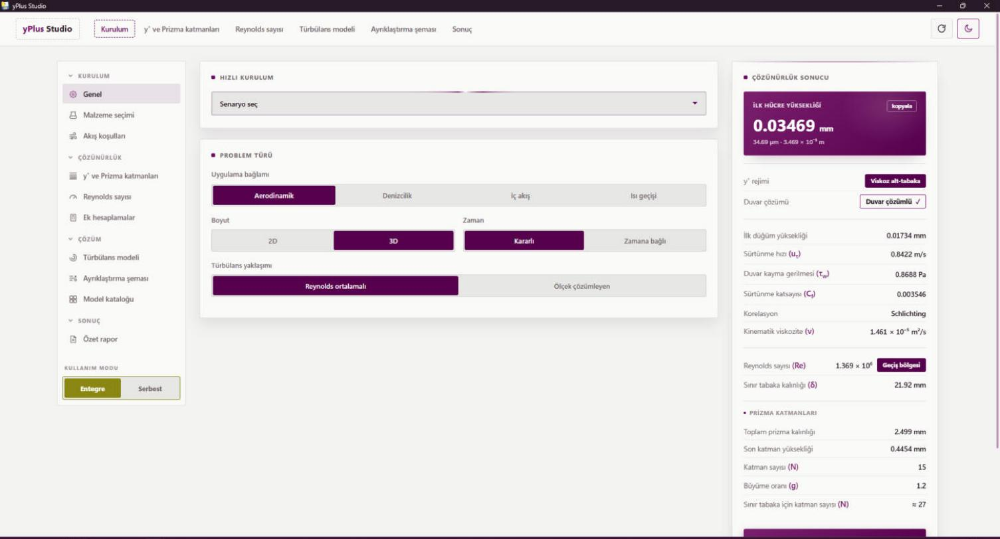

<p align="center">
  
</p>

<p align="center">
  <a href="LICENSE"></a>
  
  
  
  
</p>

**yPlus Studio** is a free, offline desktop tool for CFD engineers that turns a target **y⁺** into a complete, defensible near-wall meshing and solver setup: first cell height, inflation layers, turbulence model, near-wall treatment and discretization schemes — with physics validated against published literature.

Existing y⁺ calculators stop at the first cell height. yPlus Studio continues where they stop: it recommends the full solver configuration the way an experienced CFD engineer would, aligned with modern **ANSYS Fluent** workflows.

> 🇹🇷 The UI is Turkish with standard English technical terminology (SST k-ω, Second Order Upwind, …). Numerical inputs/outputs are universal; an English UI is on the roadmap.

---

## Features

**Wall-resolution core**
- First cell height (Δy), first node height, friction velocity (u_τ), wall shear stress (τ_w), skin-friction coefficient (C_f) and boundary-layer thickness (δ) from target y⁺, velocity, length scale and fluid state.
- y⁺ regime classification — viscous sublayer (< 5), buffer layer (5–30), log-law region (30–300) — with wall-resolved vs. wall-function guidance.
- Inflation layer designer: layer count, growth ratio, total prism thickness and δ-coverage check.

**Solver-setup advisor**
- Turbulence model recommendation from application type, Reynolds/Mach regime, time treatment and fidelity: SST k-ω, Realizable k-ε, RNG k-ε, Transition SST, Reynolds Stress (RSM), Spalart–Allmaras and SBES/LES-family scale-resolving options.
- Discretization & pressure-interpolation advisor: Second Order Upwind, QUICK, Bounded Central Differencing, PRESTO!, Body Force Weighted, AUSM for high-Mach flows, High Order Term Relaxation guidance.
- Interactive model catalog with per-model alternatives, all cross-linked between tabs.

**Engineering context**
- 100 literature-based quick-setup scenarios in 10 domains: aerospace, wind & vehicle aerodynamics, marine, internal flow, turbomachinery, heat transfer, multiphase, aeroacoustics, microfluidics, combustion.
- ISA standard atmosphere (0–20 km) with altitude in m/ft, Sutherland viscosity law, 40+ fluid presets.
- Dimensionless group suite with regime labels: Re, Ma, Fr, We, St, Eu, Pe (incl. cell Péclet), Gr, Ra, Nu (Churchill–Chu).

**Product quality**
- Fully offline, no telemetry, no accounts. Single-file engine (`index.html`) hosted in a native WebView2 window.
- Dark & light plum theme, themed PDF export of the summary report, linked/free calculation modes.

## Screenshots

| Dark | Light |
| --- | --- |
|  |  |

## Physics & validation

The wall-quantity chain follows the standard definitions:

```text
y⁺ = u_τ · y / ν        u_τ = √(τ_w / ρ)        τ_w = ½ · C_f · ρ · U²
```

- **C_f correlations:** Schlichting flat-plate `C_f = (2·log₁₀Re − 0.65)^-2.3` for turbulent external flow, with the Blasius laminar limit `C_f = 1.328/√Re` where applicable; internal-flow relations for pipe/duct setups.
- **Atmosphere & fluids:** ISA layers 0–20 km; Sutherland's law for temperature-dependent viscosity; fluid property presets from standard tables.
- **Verification:** a 49-point numerical validation suite checks computed values against published references (ISA tables, Sutherland at 15 °C / 100 °C, Schlichting/Blasius limits, speed of sound, wall-quantity chain). An automated audit covering **262,000+ input combinations** verifies the advisor never produces inconsistent model/scheme pairings.

*yPlus Studio provides guidance; final meshing and model decisions remain the engineer's responsibility.*

## Getting started

**Option A — download (recommended)**

1. Grab `yplusstudio.exe` from the [latest release](https://github.com/ahmetensar5/yplus-studio/releases).
2. Run it. No installation; Windows 10/11 with WebView2 (preinstalled on current Windows).

**Option B — build from source**

```bat
git clone https://github.com/ahmetensar5/yplus-studio.git
cd yplus-studio
build.bat
```

`build.bat` installs `pywebview`, `pythonnet` and `pyinstaller`, then produces a single-file `yplusstudio.exe`. Python 3.9+ required.

**Option C — run without building**

```bat
pip install pywebview pythonnet
python app.py
```

## Architecture

```text
index.html   ← the whole application: physics engine (window.YPHYS) + UI, vanilla JS/CSS, zero runtime deps
app.py       ← pywebview (WebView2) desktop host; Edge app-mode fallback with a local HTTP server
build.bat    ← one-command PyInstaller build (single exe, index.html embedded + external override supported)
```

Design choices: no frameworks, no network calls, deterministic math in one auditable file. The exe re-reads an `index.html` placed next to it, so the UI can be updated without rebuilding.

## Roadmap

- English UI localization
- Additional skin-friction correlations (White, Kármán–Schoenherr, Grigson)
- OpenFOAM export presets (`yPlus` function object, `snappyHexMesh` layer settings)
- STAR-CCM+ / CFX terminology mapping
- macOS & Linux packaging via pywebview

## Contributing

Issues and PRs are welcome — see [CONTRIBUTING.md](CONTRIBUTING.md). Physics changes require a literature source.

## License & citation

MIT — see [LICENSE](LICENSE). If yPlus Studio helps your research, cite it via [CITATION.cff](CITATION.cff).

## Acknowledgements

Built by [Ahmet Ensar Sarıgül](https://github.com/ahmetensar5) (mechanical engineering, CFD) in close collaboration with **Anthropic's Claude** as an AI pair-engineer; every physical relation and recommendation rule was verified against published references during development.
