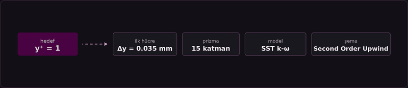
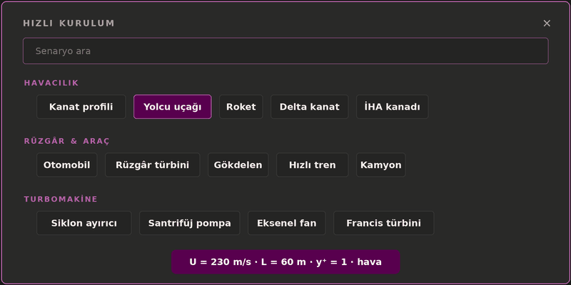
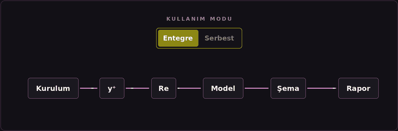

<p align="center">
  
</p>

<p align="center"><b>yPlus Studio, hedef y⁺ değerini eksiksiz bir CFD kurulumuna dönüştürür;</b> ilk hücre yüksekliği, prizma katmanları, türbülans modeli, duvar yaklaşımı ve ayrıklaştırma şemalarını kapsar. Ücretsiz, çevrimdışı, literatürle doğrulanmış. <a href="README.md">🇬🇧 English</a></p>



## Hızlı başlangıç

1. [Son sürümden](https://github.com/ahmetensarcfd/yplus-studio/releases/latest) `yplusstudio.exe` dosyasını indir
2. Çalıştır. Kurulum yok (Windows 10/11, WebView2)
3. 100 hazır senaryodan birini seç veya kendi akışını gir

## Neden yPlus Studio?

Web'deki y⁺ hesaplayıcıları tek bir sayı verir ve orada durur. yPlus Studio devam eder; prizma katman tasarımı, türbülans modeli önerisi (SST k-ω, Realizable k-ε, RSM, Transition SST, SBES), ayrıklaştırma ve basınç şeması önerisi sunar. Öneriler güncel Ansys Fluent pratiğiyle uyumludur ve her kural literatüre dayanır.

- ISA standart atmosfer (0-20 km), Sutherland viskozite, 40+ akışkan
- Re, Ma, Fr, We, St, Eu, Pe (hücre Pe dahil), Gr, Ra, Nu ve rejim etiketleri
- 10 alanda 100 literatür temelli hızlı kurulum senaryosu
- Koyu ve açık tema, PDF rapor, tamamen çevrimdışı. Hesap yok, telemetri yok

## Hızlı kurulum, 100 hazır senaryo

Senaryo seç düğmesi, 10 alanda 100 hazır kurulumdan oluşan aranabilir bir katalog açar; yolcu uçağından rüzgâr türbinine, gemi pervanesinden ısı değiştiriciye ve mikrokanala kadar uzanır. Bir senaryo seçmek tüm girdileri tek seferde doldurur (hız, uzunluk ölçeği, akışkan, y⁺ hedefi, uygulama türü, zaman) ve öneri anında hazırlanır. Değerler literatüre dayalıdır; gerçekçi başlangıç noktalarıdır.



## Çalışma modları

Uygulama sol panelden seçilen iki moddan birinde çalışır. **Entegre** modda uygulama tek bir bağlı iş akışına dönüşür; tüm sekmeler aynı duruma bağlıdır ve Kurulum'da tanımladığın akış y⁺ hesabını, Reynolds panelini, türbülans danışmanını, şema danışmanını ve özet raporu tek zincir hâlinde besler. **Serbest** modda zincir çözülür ve her bölüm bağımsız çalışır; her hesaplayıcı kendi girdilerini alır, öneri yalnızca güncelle düğmesine bastığında yenilenir.



## Doğrulama

Fizik, 49 noktalı literatür doğrulama takımıyla (ISA, Sutherland, Schlichting ve Blasius, duvar büyüklükleri) sınanır; öneri motoru ise 250.000+ kombinasyonluk otomatik denetimden geçer. Nihai ağ ve model kararı mühendisindir.

## Kaynaktan derleme

```bat
git clone https://github.com/ahmetensarcfd/yplus-studio.git
cd yplus-studio
build.bat
```

Lisans MIT'dir; ayrıntılar [LICENSE](LICENSE) dosyasındadır. Katkı rehberi için [CONTRIBUTING.md](CONTRIBUTING.md) dosyasına bakın.
